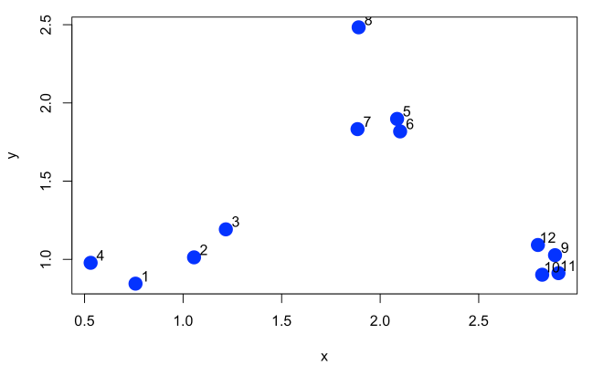

### ... or about the benefits of reinventing the wheel   

```{r setup, include=FALSE}
knitr::opts_chunk$set(echo = TRUE,
                      fig.width = 8)

library(tidyverse)
library(gganimate)
library(animation)

source("helper_functions.R")

ani.options(ani.width = 780)
```

### **Intro**

It all began with the fact that I've decided to study k-means clustering algorithm. The more resources I read, the more confused . The  definition of cluster centers has been stumbling-block. The most accessible explanation was provided by [Wikipedia](https://en.wikipedia.org/wiki/K-means_clustering):

> Assign each observation to the cluster whose mean has the least squared Euclidean distance.

But how does this happen? So I've decided to reinvent a wheel and reproduce step by step all stages of the algorithm.
As a basis I've decided to take an example from the book by Roger D. Peng [Exploratory Data Analysis with R](https://bookdown.org/rdpeng/exdata/k-means-clustering.html).

Because I'm a passionate fan of R I've decided to use fantastic package [tydiverse](https://www.tidyverse.org/) to reproduce algorithm and [gganimate](https://github.com/thomasp85/gganimate) to visualize result.  
So, let's begin!

### **1. Dive into k-means**

#### **Data preparation**
I've decided to reproduce dataset that is provided by Roger D.Peng (Figure 12.1: Simulated dataset)
```{r}
set.seed(1234)
x <- c(0.75, 1.1, 1.25, 0.55, 2.15, 2.17, 1.85, 1.86, 2.87, 2.75, 2.91, 2.71)
y <- c(0.6, 1.0, 1.25, 1.0, 1.9, 1.8, 1.85, 2.5, 1.0, 0.85, 0.86, 1.18)
df_xy <- tibble(x, y) %>% rowid_to_column()
# Length of dataset
n_xy <- dim(df_xy)[1]
```
Let's take three clusters for example
```{r}
Cx = c(1, 1.7, 2.5)
Cy = c(2, 1.0, 1.5)
# Number of clusters define as length of Cx or Cy vectors
n_clust <- length(Cx)
df_cl <- tibble(Cluster = factor(seq(n_clust), ordered = T), Cx, Cy)
```
Next create a dataset with coordinates of observations and coordinates of cluster centers
```{r}
df_kmeans0 <- bind_cols(df_xy, map_dfr(df_cl, rep, length.out = length(x)))
```
Here's how all this looks like at the initial stage  
```{r}
ggplot(df_kmeans0, aes(x, y)) +
  geom_point(shape = 1, size = 5, stroke = 1) +
  geom_text(aes(x, y, label = rownames(df_xy)), vjust = 2.0, size = 4, color = "black") + 
  geom_point(aes(Cx, Cy, color = Cluster), shape = 3, size = 5, stroke = 1) +
  coord_equal() +
  labs(title = "The initial location of the cluster centers") +
  theme(plot.title = element_text(hjust = 0.5))
```

Now let's look what's happen under the hood of k-means

#### **Step 1. Calculate squared Euclidean distance between each observations and each clusters**
Firs of all we need to choose a metric for measuring distance between observations and cluster's centers. Let it be Euclidean distance
or rather squared Euclidean distance.

> Eu_dist^2^ = (x~i~ - x~c~)^2^ + (y~i~ - y~c~)^2^

Next, it needs to determine the distance from each point to each cluster. Since we have 12 points and 3 clusters, we get 36 distances. It was the first stumbling-block.
```{r}
df_dist <- bind_cols(map_dfr(df_xy, rep, n_clust),
                     map_dfr(df_cl, rep, each = n_xy)) %>% 
  mutate(Eu_dist = sqrt((.$x - .$Cx)^2 + (.$y - .$Cy)^2))
df_dist
```
#### **Step.2 Assign each observation to the cluster whose mean has the least squared Euclidean distance**

```{r}
step2 <- df_dist %>% 
  select(-Cx, -Cy) %>% 
  spread(Cluster, Eu_dist) %>% 
  nest(-rowid, -x, -y) %>%
  mutate(Eu_dist = map_dbl(.$data, min),
         Cluster = map_dbl(.$data, which.min) %>% factor(., ordered = T)) %>%
  unnest(data)
step2
```
Columns 1-3 represent all (3 in our case)  distances of observation to each cluster. We need to choose the minimum value for each observation. They are gathered in Eu_dist column. So, the columns Eu_dist and Cluster demonstrate which observations to which clusters belong. It was the second and the last stumbling-block. 

#### **Step 3. Join cluster's coordinates to previous dataset**
Now it remains to add the coordinates of cluster centers to our previous data set  
```{r}
step2 %>%
  left_join(df_cl, by = 'Cluster') -> step3
step3
```
Let's demonstrate result  
```{r}
ggplot(step3, aes(x, y, color = Cluster)) +
  geom_point(size = 5) +
  geom_point(aes(x = step3$Cx, y = step3$Cy), shape = 3, size = 7) +
  geom_text(label = rownames(step3), vjust = 1.8, size = 4, color = 'black') +
  coord_fixed()
```

#### **Step 4. Recalculation center's coordinates of new clusters**
```{r}
step3 %>% 
  select(-num_range("", 1:n_clust)) %>% 
  group_by(Cluster) %>% 
  mutate(Cx2 = mean(x),
         Cy2 = mean(y)) -> step4
step4
```
Let's look at new clusters (smaller size - are initial values)  
```{r}
step4 %>% 
  ggplot(aes(x, y, color = Cluster)) +
    geom_point(size = 5) +
    geom_point(aes(x = step4$Cx, y = step4$Cy), shape = 3, size = 3) +
    geom_point(aes(x = step4$Cx2, y = step4$Cy2), shape = 3, size = 6) +
    geom_text(aes(label = rownames(step4)), vjust = 1.8, size = 4, color = 'black') 
```

Put our dataset with new clusters into "canonical" form  
```{r warning=FALSE}
step4 %>% 
  select(Cluster, Cx2, Cy2) %>% 
  group_by(Cluster) %>% 
  unique(.) %>% 
  arrange(Cluster) -> new_iteration
new_iteration
```
Next - repeat iteration from step 1 and so on, but for this purpose it needs to have something like recursive function or even two!. I've created k_means() function that execute k-means algorithm and wrapper_kmeans() function for calling k_means() in the best way. These function and couple others are contained in helper_functions.R file.   
It must be noted, at this stage I've became aware of the principle of k-means, but I wanted to see the result for several iterations and compare one with a regular algorithm - the kmeans() function.  
So, let's keep on!

### **2. k-means from a bird's eye view**

Set number of iteration and pass it with observation (df_xy) and cluster (df_cl) tibbles to wraper_kmeans(). It return list of tibbles with observations and clusters from k_means() function from all iterations.
```{r warning=FALSE}
n_iter <- 5 # nubmer of k-means iterations
df_kmeans <- wraper_kmeans(df_xy, df_cl, n_iter)
df_kmeans[[n_iter]]
```
Also we can view main results of k_means algorithm for chosen iteration
```{r warning=FALSE, paged.print=FALSE}
my_kmeans <- get_kmeans(n_iter, df_kmeans)
my_kmeans
```
 ... and compare it this result of build-in k-means() function
```{r echo=FALSE}
kmeans(df_xy[, -1], centers = 3, iter.max = n_iter)
```
And how about visualization? And it is desirable with animation!   
Yes of course! But first make "long" dataframe from the df_kmeans list:
```{r}
df_long <- map_dfr(df_kmeans, ~ .)
```
Ta da!
```{r warning=FALSE, fig.show = 'animate'}
theme_ani <- theme(
          plot.title = element_text(size = 14, face = "bold", hjust = 0.5),
          legend.title = element_text(face = "bold", colour = "black", size = 12),
          legend.text = element_text(size = 11, color = "black"),
          axis.text = element_text(size = 11, colour = "black"),
          axis.title = element_text(size = 12, face = "bold"))

ggplot(df_long, aes(x, y, color = Cluster, frame = Iteration)) +
  geom_point(aes(group = Cluster), size = 5) +
  geom_point(aes(x = Cx, y = Cy), shape = 3, size = 5, color = "black", stroke = 1) +
  geom_path(aes(x = Cx, y = Cy, cumulative = TRUE, group = Cluster),
            color = "black") +
  geom_text(aes(x, y, label = rowid), vjust = 1.8, size = 4, color = 'black') +
  geom_polygon(data = df_polygon(df_kmeans),
               aes(x, y, group = Cluster, fill = Cluster), alpha = .5) +
  coord_equal() +
  labs(title = "How k-means work:") +
  theme_ani -> gg
gganimate(gg)
```
```{r fig.show = 'animate'}
ggplot(df_long, aes(x = rowid, y = Eu_dist, frame = Iteration, cumulative = TRUE)) +
  geom_point(aes(color = Iteration), size = 5) +
  geom_line(aes(color = Iteration), size = 1) +
  scale_x_continuous(breaks = 1:dim(df_xy)[1]) +
  labs(x = "Observations", y = "Euclidean distance squared",
       title = "Squared Euclidean distance for each observation on:") +
  theme_ani -> gg_dist

gganimate(gg_dist)
```
```{r fig.show = 'animate'}
df_long %>% 
  group_by(Iteration) %>% 
  summarise(tot_sum = sum(Eu_dist)) %>% 
  ungroup() %>% 
  ggplot(aes(x = Iteration, y = tot_sum, frame = Iteration, cumulative = TRUE)) +
    geom_bar(stat = 'identity', aes(fill = Iteration)) +
    labs(x = NULL, title = "Total within-cluster sum of square on:") +
    theme_ani -> gg_tot_sum

gganimate(gg_tot_sum)
```

#### **Comment#1**  

By the end I want to mention some things.   
This is a demonstration example, so the k-means algorithm implemented here may be far from effective. Because of this, I do not recommend using it with large datasets and a large number of iterations (> 10). Of course, you can use your own dataset if you are interested.   

#### **Comment#2**   

So, what have I achieved by reinventing the wheel:   
1.  Understood the [k-means](https://en.wikipedia.org/wiki/K-means_clustering) algorithm, of course)   
2.  Improved my skills in [tydiverse](https://www.tidyverse.org/)   
3.  Learned to write recursive functions that return two values, one of which is necessary for recursion work, and the other - for external needs (this is what wraper_kmeans() return). This was achieved by the additional wrapper function and the concept of environments.  
4.  Learned to make animated charts with [gganimate](https://github.com/thomasp85/gganimate).  
5.  Examined [chull](https://www.rdocumentation.org/packages/grDevices/versions/3.5.1/topics/chull) function from base R   
6.  Learned how to [hide comments](https://stackoverflow.com/questions/4823468/comments-in-markdown) in [Rmarkdown](https://rmarkdown.rstudio.com/index.html)  
    
I'd be appriciate for your critical remarks and comments. Well, of course I will be very-very-very happy if this material helps you understand k-means as it helped me! You can find code [here](https://github.com/DmytroRybalko/k-means_explanation)
